# GPS Action — Entity Relationship Diagram

**Status:** Slice 1 landed (foundation entities). Slices 2–4 to follow.
**Build Unit:** BU-001-prep (this session). BU-001 (admin scaffolding) consumes the schema.
**Authoritative schema:** [`prisma/schema.prisma`](../../prisma/schema.prisma)
**Metadata map:** [`server/admin/entity-metadata.ts`](../../server/admin/entity-metadata.ts)

This document explains the _why_ alongside the _what_. The Prisma file is the
source of truth for shape; this file is the source of truth for rationale and
the slice plan.

---

## Slice convention

The ERD lands one slice at a time. Each slice **adds** to
`prisma/schema.prisma` and `server/admin/entity-metadata.ts`; previous slices
are not refactored without an ADR. The Mermaid diagram below extends with each
slice — earlier entities never disappear.

| Slice   | Status    | Contents                                                                                                   |
| ------- | --------- | ---------------------------------------------------------------------------------------------------------- |
| **1**   | ✅ landed | User, Region, UserRegion, WorkItem, RoleGrant, CoordinatorProfile, CoordinatorGroup, AuditLog, FeatureFlag |
| **1.5** | ✅ landed | Group, GroupMembership + WorkItem.groupTags (per D043)                                                     |
| 2       | planned   | Post, Comment, Reaction, Attachment + dedup fields (per dedup-and-cosurfacing.md)                          |
| 3       | planned   | Application (vetting), Flag, OutcomeReview, EditRequest, ContentSubmission, Vouch                          |
| 4       | planned   | Contact, Resource, Route, DispatchEvent, PartnerOrg                                                        |

When a future slice begins, the brief lists the new entities, names the
relations to existing entities, and adds them to this diagram. No previous
slice's schema changes without an ADR documenting why.

---

## Slices 1 + 1.5 — Mermaid diagram

```mermaid
erDiagram
    User ||--o{ UserRegion : "regions of interest"
    Region ||--o{ UserRegion : "members"
    Region ||--o{ Region : "parent / children"

    User ||--o{ WorkItem : "created"
    User ||--o{ WorkItem : "claimed"
    User ||--o{ WorkItem : "resolved"

    User ||--o{ RoleGrant : "subject of grant"
    User ||--o{ RoleGrant : "granted by"
    User ||--o{ RoleGrant : "revoked by"

    User ||--o| CoordinatorProfile : "has"
    CoordinatorProfile ||--o{ CoordinatorGroup : "owns"

    User ||--o{ AuditLog : "actor"
    User ||--o{ AuditLog : "target"

    User ||--o{ FeatureFlag : "owns"
    User ||--o{ FeatureFlag : "created"
    User ||--o{ FeatureFlag : "updated"

    User ||--o{ Group : "created"
    User ||--o{ GroupMembership : "member of"
    User ||--o{ GroupMembership : "approved"

    Group ||--o{ GroupMembership : "members"

    User {
        uuid     id PK
        string   email "unique"
        string   displayName
        string   phoneNumber "nullable"
        datetime verifiedAt "nullable"
        datetime lastSeenAt "nullable"
        datetime createdAt
        datetime updatedAt
        datetime deletedAt "nullable - soft delete"
    }

    Region {
        uuid       id PK
        string     slug "unique"
        string     displayName
        RegionType type "national | region | council"
        uuid       parentId FK "nullable"
        datetime   createdAt
        datetime   updatedAt
        datetime   deletedAt "nullable - soft delete"
    }

    UserRegion {
        uuid     id PK
        uuid     userId FK
        uuid     regionId FK
        datetime createdAt
    }

    WorkItem {
        uuid               id PK
        WorkItemType       type
        WorkItemStatus     status "default unclaimed"
        WorkItemPriority   priority "default normal"
        json               context "type-specific payload"
        string             regionSlug "informational only"
        string_arr         groupTags "Group slugs - GIN indexed"
        uuid               createdByUserId FK "nullable"
        uuid               claimedByUserId FK "nullable"
        datetime           claimedAt "nullable"
        datetime           claimExpiresAt "nullable"
        datetime           lastHeartbeatAt "nullable"
        uuid               resolvedByUserId FK "nullable"
        datetime           resolvedAt "nullable"
        WorkItemResolution resolution "nullable"
        string             resolutionNotes "nullable"
        datetime           createdAt
        datetime           updatedAt
        datetime           deletedAt "nullable - soft delete"
    }

    RoleGrant {
        uuid       id PK
        uuid       userId FK
        SystemRole role "queue_manager | admin"
        datetime   grantedAt
        uuid       grantedByUserId FK
        string     grantedReason
        datetime   revokedAt "nullable"
        uuid       revokedByUserId FK "nullable"
        string     revokedReason "nullable"
        datetime   createdAt
    }

    CoordinatorProfile {
        uuid     id PK
        uuid     userId FK "unique"
        string   notes "nullable"
        datetime createdAt
        datetime updatedAt
        datetime deletedAt "nullable - soft delete"
    }

    CoordinatorGroup {
        uuid     id PK
        uuid     coordinatorProfileId FK
        string   name
        string   description "nullable"
        string   logoUrl "nullable"
        int      reachEstimate "nullable"
        datetime reachVerifiedAt "nullable"
        datetime createdAt
        datetime updatedAt
        datetime deletedAt "nullable - soft delete"
    }

    AuditLog {
        uuid     id PK
        string   action
        string   entityType
        string   entityId
        uuid     userId FK "nullable - actor"
        uuid     targetUserId FK "nullable"
        json     changes "nullable"
        json     context "nullable"
        string   ipAddress "nullable"
        string   userAgent "nullable"
        datetime createdAt
    }

    FeatureFlag {
        uuid               id PK
        string             name "unique"
        string             description
        FeatureFlagPurpose purpose "rollout | kill_switch | pilot_gate"
        boolean            enabledGlobally "default false"
        string[]           enabledForUserIds
        string[]           enabledForGroupIds
        string[]           enabledForRegions
        int                rolloutPercentage "default 0"
        datetime           ttlRemoveAfter "nullable"
        uuid               ownerUserId FK "nullable"
        uuid               createdByUserId FK
        uuid               updatedByUserId FK
        datetime           createdAt
        datetime           updatedAt
        datetime           deletedAt "nullable - soft delete"
    }

    Group {
        uuid            id PK
        string          slug "unique"
        string          displayName
        string          description "nullable"
        string          logoUrl "nullable"
        GroupJoinPolicy joinPolicy "default open"
        boolean         isOfficial "default false"
        uuid            createdByUserId FK
        datetime        createdAt
        datetime        updatedAt
        datetime        deletedAt "nullable - soft delete"
    }

    GroupMembership {
        uuid                id PK
        uuid                userId FK
        uuid                groupId FK
        GroupMembershipRole role "default member"
        datetime            joinedAt
        JoinSource          joinedVia "default self_join"
        datetime            leftAt "nullable - voluntary departure"
        string              leftReason "nullable"
        uuid                approvedByUserId FK "nullable"
        datetime            approvedAt "nullable"
        datetime            createdAt
        datetime            updatedAt
        datetime            deletedAt "nullable - soft delete"
    }
```

---

## Entities — at a glance

| Entity                 | Purpose                                                                                                                         | Soft-deleted?                                    | Key invariants enforced where                                                                                                                         |
| ---------------------- | ------------------------------------------------------------------------------------------------------------------------------- | ------------------------------------------------ | ----------------------------------------------------------------------------------------------------------------------------------------------------- |
| **User**               | Identity for any human. No location fields per D041.                                                                            | Yes (`deletedAt`)                                | App-level: cannot self-revoke admin; cannot revoke last admin                                                                                         |
| **Region**             | Hierarchy-only place model (national / region / council). No geospatial data per D041.                                          | Yes (`deletedAt`)                                | App-level: parent chain acyclic                                                                                                                       |
| **UserRegion**         | Member ↔ region affinity. Informational only per D041 — does not drive feed or queue filtering. **Purpose needs confirmation.** | No                                               | DB: composite unique on `(userId, regionId)`                                                                                                          |
| **WorkItem**           | Unified queue primitive (D040). All claimable workflows.                                                                        | Yes (`deletedAt`)                                | DB: indexes for queue + region informational queries. App-level: atomic claim, TTL + 4-hour cap, claimed/resolved field invariants                    |
| **RoleGrant**          | Dynamic role provenance (D042). Active = `revokedAt IS NULL`.                                                                   | No — revocation is a status change, not a delete | App-level: one active grant per (user, role); admin-grant special rules                                                                               |
| **CoordinatorProfile** | Member's identity as a coordinator of external communities (D042). One-to-one with User.                                        | Yes (`deletedAt`)                                | DB: unique on `userId`                                                                                                                                |
| **CoordinatorGroup**   | A specific external group a coordinator runs (WhatsApp, newsletter, etc.).                                                      | Yes (`deletedAt`)                                | Cascade-deletes with the parent profile                                                                                                               |
| **AuditLog**           | Immutable record of sensitive events (B07). Append-only.                                                                        | No — never deleted                               | App-level: routers must not expose update or delete procedures. `userId` and `targetUserId` use `SetNull` so user hard-deletes leave the chain intact |
| **FeatureFlag**        | Homegrown DB-driven flags (D036). Server-side evaluation.                                                                       | Yes (`deletedAt`)                                | App-level: rollout flags require `ttlRemoveAfter`; kill switches require `ownerUserId`; new flags default OFF                                         |
| **Group**              | Internal affiliation marker (D043). Identity + soft queue filtering; no permission impact, no feed fragmentation.               | Yes (`deletedAt`)                                | DB: unique on `slug`. App-level: slug immutable after creation; soft-deleted groups hidden from default queries                                       |
| **GroupMembership**    | Join table: User ↔ Group. Tracks how they joined and (optionally) who approved.                                                 | Yes (`deletedAt` + `leftAt` for departures)      | DB: `@@unique([userId, groupId])`. App-level: one active membership per pair; re-join creates new row                                                 |

---

## On Cascade vs Restrict vs SetNull

Every relation declares an explicit `onDelete`. The choices follow three
principles:

1. **Lifecycle children cascade with their parent.** If the parent is the
   meaningful object, the child is meaningless without it.
   - `CoordinatorGroup` → `CoordinatorProfile`: `Cascade`
   - `CoordinatorProfile` → `User`: `Cascade`
   - `RoleGrant.user` → `User`: `Cascade`
   - `UserRegion.{user, region}` → parent: `Cascade`
   - `GroupMembership.{user, group}` → parent: `Cascade`

2. **Audit-bearing references restrict.** A user who has granted roles or
   created/owned feature flags cannot be hard-deleted until those references
   are reassigned. This preserves the audit chain.
   - `RoleGrant.grantedBy` → `User`: `Restrict`
   - `RoleGrant.revokedBy` → `User`: `Restrict`
   - `FeatureFlag.owner` → `User`: `Restrict`
   - `FeatureFlag.createdBy` → `User`: `Restrict`
   - `FeatureFlag.updatedBy` → `User`: `Restrict`
   - `Region.parent` → `Region`: `Restrict` (don't orphan child regions silently)
   - `Group.createdBy` → `User`: `Restrict` (preserves "who created this group" audit chain)

3. **Historical-actor references null.** Where the relation is "who did this
   at the time," losing the actor doesn't invalidate the record itself —
   nullify the FK so the record persists.
   - `WorkItem.{createdBy, claimedBy, resolvedBy}` → `User`: `SetNull`
   - `AuditLog.{user, targetUser}` → `User`: `SetNull`
   - `GroupMembership.approvedBy` → `User`: `SetNull`

In practice **soft-delete will be the default**; hard-deletes only happen
for compliance (DSAR, GDPR right to erasure) and run through dedicated
procedures, not the generic admin (per admin-surface.md).

---

## Indexes — what's queried

| Entity             | Index                                                               | Why                                                |
| ------------------ | ------------------------------------------------------------------- | -------------------------------------------------- |
| User               | `(deletedAt)`, `(verifiedAt)`                                       | Soft-delete filter; vetting status filter          |
| Region             | `(type)`, `(parentId)`, `(deletedAt)`                               | List by tier; hierarchy walks; soft-delete filter  |
| UserRegion         | `(userId, regionId)` unique; `(userId)`, `(regionId)`               | Affinity lookup both directions                    |
| WorkItem           | `(status, priority, createdAt)`                                     | Queue list (default sort)                          |
| WorkItem           | `(claimedByUserId, status)`                                         | "What am I working on?"                            |
| WorkItem           | `(type, status)`                                                    | Per-type queue filtering                           |
| WorkItem           | `(regionSlug, status)`                                              | Informational region rollups                       |
| WorkItem           | `(deletedAt)`                                                       | Soft-delete filter                                 |
| RoleGrant          | `(userId, role, revokedAt)`                                         | Active-role test                                   |
| RoleGrant          | `(grantedAt)`                                                       | History view sort                                  |
| CoordinatorProfile | `(deletedAt)`                                                       | Soft-delete filter                                 |
| CoordinatorGroup   | `(coordinatorProfileId, deletedAt)`                                 | List a coordinator's groups                        |
| AuditLog           | `(userId, createdAt)`                                               | "What did Sharon do this week?"                    |
| AuditLog           | `(targetUserId, createdAt)`                                         | "What was done to this user?"                      |
| AuditLog           | `(entityType, entityId)`                                            | Entity history view                                |
| AuditLog           | `(action, createdAt)`                                               | Filter by event type                               |
| AuditLog           | `(createdAt)`                                                       | General time-range queries                         |
| FeatureFlag        | `(purpose)`, `(enabledGlobally)`, `(ttlRemoveAfter)`, `(deletedAt)` | Filter by type, find expiring flags                |
| WorkItem           | `(groupTags)` GIN                                                   | Queue filtering by group slug array                |
| Group              | `(deletedAt, isOfficial)`                                           | List non-deleted groups; filter by official status |
| GroupMembership    | `(userId, groupId)` unique                                          | One active membership per pair                     |
| GroupMembership    | `(userId)`                                                          | "What groups is this user in?"                     |
| GroupMembership    | `(groupId, leftAt)`                                                 | Active members of a group                          |
| GroupMembership    | `(deletedAt)`                                                       | Soft-delete filter                                 |

---

## How Slice 1 supports the scenarios

(Verifying the brief's "Scenarios to verify against" — feature entities arrive
in later slices, but the foundation must support their data shapes.)

- **SCN-04 (Sharon flags a post).** When Slice 3 lands `Flag`, a `WorkItem`
  of `type = flag` will be created with `context = { flagId, postId, ... }`.
  Claim/release/resolve lifecycle works today. ✓
- **SCN-08 (Vetting flow).** Same pattern: `WorkItem` of `type = vetting`
  with `context = { applicationId, vouchedByIds, ... }`. ✓
- **Coordinator scenario.** A user can hold a `CoordinatorProfile` with many
  `CoordinatorGroup`s, independently of any `RoleGrant` they may or may not
  hold. ✓ (per D042)
- **Region tagging.** `Region` exists for future `Post.regionTagId` (Slice 2)
  and `WorkItem.regionSlug` is already populated. ✓

---

## Slice 1.5 — Groups

### What was added and why

Slice 1.5 introduces two new entities (**Group**, **GroupMembership**), three
new enums (**GroupJoinPolicy**, **GroupMembershipRole**, **JoinSource**), and
extends the existing **WorkItem** with a `groupTags String[]` column.

**Motivation (D043):** GPS Action has one unified feed (D041), but members have
natural affinities — writers, BDS responders, geographic cohorts. Groups give
those affinities a data-model home without fragmenting the feed. They serve two
purposes:

1. **Identity markers** — members join groups and display badges on their
   profile
2. **Soft queue filtering** — queue managers can filter work items by group
   slugs stored in `WorkItem.groupTags`

Groups explicitly do NOT grant permissions, filter the feed, or create private
spaces (per D041, D043).

### Key design choices

| Choice                                         | Rationale                                                                                                                                         |
| ---------------------------------------------- | ------------------------------------------------------------------------------------------------------------------------------------------------- |
| `Group` vs `CoordinatorGroup` naming           | Different concepts: `Group` = internal GPS Action affiliation; `CoordinatorGroup` = external community a coordinator runs. Per D042/D043          |
| `groupTags String[]` on WorkItem (not FK)      | A work item can relate to multiple groups; Postgres arrays + GIN index are efficient for `ANY()` queries; FK constraints on arrays are impossible |
| `GroupMembership.leftAt` alongside `deletedAt` | `leftAt` = domain event (member voluntarily departed); `deletedAt` = admin soft-delete. Different operations with different semantics             |
| `joinedAt` + `createdAt` on GroupMembership    | `joinedAt` is the domain timestamp; `createdAt` is the convention-4 timestamp. Same pattern as `RoleGrant.grantedAt` + `createdAt`                |
| `approvedBy` uses `SetNull` (not Restrict)     | Approval is a historical-actor reference; if the approving admin is hard-deleted, the membership record persists                                  |
| `Group.createdBy` uses `Restrict`              | Preserves "who created this group" audit chain — same rationale as `FeatureFlag.createdBy`                                                        |
| No `@@index([slug])` on Group                  | `@unique` already creates an index; a separate `@@index` would be redundant. Consistent with `User.email` and `Region.slug` patterns              |

### How Slice 1.5 supports the scenarios

- **Member joins "Writers" (open group).** Single `GroupMembership` row:
  `joinedVia=self_join`, `leftAt=NULL`. ✓
- **Member requests to join "Vetting Team" (request_to_join).** Future
  `WorkItem` of type `group_join_request` created; on approval,
  `GroupMembership` created with `joinedVia=request_approved`,
  `approvedByUserId` populated. ✓ (enum value deferred to the implementing
  Build Unit)
- **Admin adds member to "Founding Members" (admin_only).**
  `GroupMembership` with `joinedVia=admin_added`, `approvedByUserId`
  populated. ✓
- **Member leaves a group.** `leftAt` + optional `leftReason` set; row stays
  for history. ✓
- **Queue manager filters by group.** `WHERE 'writers' = ANY(groupTags)`
  against WorkItem, using the GIN index. ✓
- **Admin archives a group.** `deletedAt` set on Group; memberships remain
  but group hidden from default queries. ✓

---

## Open questions surfaced this session

These are choices the schema cannot make autonomously. The ERD ships with the
indicated defaults; if any is wrong, fix forward in a follow-on PR with an
ADR.

### 0. Purpose of `UserRegion` (NEW — most important)

The brief lists `UserRegion` as a required entity but no architecture doc
defines it, and D041 explicitly removes member-region scoping. Possible
interpretations:

- (a) "Regions a member is interested in" — informational affinity only
- (b) "Regions a member operates in" — activism patches
- (c) Future-filter affinity (sets up the user-side of the parking-lot
  region-filter feature)
- (d) Mistake in the brief — entity should not exist

**Default chosen:** (a) — modelled minimally as `(userId, regionId, createdAt)`
with no semantic-bearing fields. Cheap to refactor if (b)–(d) is the right
answer.

### 1. RoleGrant active-state uniqueness

Postgres supports partial unique indexes (`UNIQUE (userId, role) WHERE
revokedAt IS NULL`) but Prisma 5 does not have first-class syntax for them.

- Plain `@@unique([userId, role])` is too restrictive (can't re-grant after
  revoke).
- `@@unique([userId, role, revokedAt])` does not work as intended — Postgres
  treats each `NULL` as distinct, so multiple active grants can coexist.

**Default chosen:** App-level enforcement only. The grant procedure checks for
an existing active grant before insert. Documented in the schema. If we want
DB-level enforcement, we add a partial unique index via a raw migration.

### 2. `RegionType` enum values

**Default chosen:** `national | region | council`. Confirm or expand.
Edge cases that may surface:

- _Borough_ / _unitary authority_ / _parish_ — currently all under `council`
- _Devolved nation_ (Scotland, Wales, NI) — currently under `region`

### 3. Seed Region data

Per M5 in admin-surface.md context, MVP wants ~20 major UK places + national.
**Default chosen:** Do not seed in this session — F10 covers seed. README
documents the expected seed shape.

### 4. `User` baseline fields

**Default chosen** (open question 4 in the brief, picked):

- `email` (unique, required)
- `displayName` (required)
- `phoneNumber` (optional — for future MFA)
- `verifiedAt` (timestamp; null = unverified)
- `lastSeenAt` (timestamp)

Anything missing? Auth-provider-specific columns (e.g. NextAuth's `accounts`
join table) will be added when the auth Build Unit lands.

### 5. `AuditLog` shape

**Default chosen:**

- `id`, `action` (string), `entityType` (string), `entityId` (string)
- `userId` (actor — nullable for system-generated entries)
- `targetUserId` (nullable)
- `changes` (Json, nullable), `context` (Json, nullable)
- `ipAddress`, `userAgent` (both string, nullable)
- `createdAt` only (no `updatedAt` — immutable)

`action` and `entityType` are open strings rather than enums because the
vocabulary extends per Build Unit; locking it in an enum would force a
migration per new event.

### 6. UUID generation

**Default chosen:** `@default(uuid())` (Prisma generates UUIDv4
application-side). No `pgcrypto` extension needed.

### 7. Tooling parity (NEW — minor)

The brief uses `pnpm prisma validate`. `package.json` declares `npm`. This
session ran the equivalent `npx prisma validate` / `npx prisma format` and
both passed. If the project is moving to `pnpm`, that's a separate Phase 0
item.

### 8. ESLint boundary classification for `server/admin/` (NEW — minor)

`eslint.config.js` does not list `server/admin/` as an element type. The
boundaries plugin therefore applies no layer rule to files there. The brief
forbids touching ESLint config in this session, so this is left as-is — but
a follow-up should classify `server/admin/` (likely as its own type allowing
imports from `shared` and `db`) so the metadata file isn't an unclassified
island.

### 9. `Ping` placeholder cleanup (NEW)

CLAUDE.md says the `Ping` entity should be removed "after ERD lands." Removing
it breaks `server/services/ping.ts`, `server/routers/ping.ts`,
`server/routers/_app.ts`, `scripts/seed.ts`, and `tests/unit/ping.test.ts` —
all of which the Slice 1 brief explicitly forbids touching.

**Default chosen:** Kept in schema as a transitional model. A follow-up
"remove placeholders" PR (or BU-001 itself) deletes the model and the
downstream files.

### 10. `WorkItem.groupTags`

D043 mentions a `WorkItem.groupTags: string[]` field, but Group lands in
Slice 1.5 and `claim-and-lease.md` does not include this field. The brief
requires "EXACTLY" matching `claim-and-lease.md`.

**Default chosen:** Not added in Slice 1. Slice 1.5 (Groups) adds it.

## Open questions surfaced in Slice 1.5

### 11. GIN index syntax for Prisma 5

Prisma 5.22.0 supports `@@index([groupTags], type: Gin)`. Verified: schema
validates with this syntax. No fallback needed.

### 12. `JoinSource` enum completeness

Four values shipped: `self_join`, `request_approved`, `admin_added`,
`admin_invited`. Considered adding `imported` / `migrated` for future
bulk-migration scenarios.

**Default chosen:** Four values sufficient for MVP. If a migration or import
flow is needed later, the enum is extended forwards (per slice convention
rule 4). No action now.

### 13. Seed data for starter groups

This session does NOT seed groups (per out-of-scope). The ~10 starter groups
listed in `docs/product/groups.md` §"Migration / bootstrap" (Writers,
Newsletter Editors, Talk Radio Group, Vetting Team, Education Campaigns, BDS
Response Team, Manchester, North London, South London, etc.) should be
created by the F10 seed session.

**Recommendation:** F10 references `docs/product/groups.md` for the starter
list. No additional documentation needed here.

### 14. `WorkItemType` extension for `group_join_request`

`groups.md` describes a `group_join_request` work-item type for
`request_to_join` groups. The `WorkItemType` enum currently does not include
it.

**Default chosen:** Deferred. The enum value belongs in the Build Unit that
implements the join-request workflow. Adding it now would create a type with
no code path to create or resolve it. Per slice convention rule 4, enums grow
forwards.

### 15. File-header `@build-unit` value

**Default chosen:** Continue using `BU-001-prep`. Slice 1.5 feeds into BU-001
admin scaffolding just as Slice 1 does. Both are "prep" for the same Build
Unit.

### 16. `CoordinatorGroup` vs `Group` naming

Two different concepts share "Group" in their names:

- `CoordinatorGroup` — external community a coordinator runs (WhatsApp,
  newsletter, shul network). Slice 1, per D042.
- `Group` — internal GPS Action affiliation marker. Slice 1.5, per D043.

Per D042 and D043, this is the agreed-upon language. The schema comments
explicitly document the distinction. No tangible naming conflict found — the
Prisma model names are unambiguous (`CoordinatorGroup` vs `Group`), and the
admin metadata keys are similarly distinct.

### 17. `GroupMembership.deletedAt` vs `leftAt` (NEW)

`groups.md` uses `leftAt` as the soft-delete marker (comment: "Soft delete
(left the group)") and does not include `deletedAt`. Convention 2 requires
`deletedAt DateTime?` on soft-delete-eligible entities. The brief's acceptance
criteria explicitly requires `deletedAt` on GroupMembership.

**Default chosen:** Include both. `leftAt` = domain event (member voluntarily
departed). `deletedAt` = admin-level soft-delete. They serve different
purposes, similar to how `RoleGrant` has `revokedAt` as a domain marker
(though RoleGrant doesn't have `deletedAt` since revocation IS the status
change).

---

## What this doc does NOT cover

1. **Migration generation.** `prisma migrate dev` produces the SQL — separate
   session.
2. **Per-type `WorkItem.context` Zod schemas.** Defined per Build Unit when
   each feature ships.
3. **Seed data.** F10 covers seed (`prisma/seed.ts`).
4. **The `isFeatureEnabled()` evaluation function.** Separate Build Unit
   implementing the feature-flag service.
5. **Auth provider integration.** Identity columns are present; the auth
   Build Unit chooses NextAuth / Auth.js / Clerk / Lucia and adds tables.
6. **Performance tuning beyond the indexes above.** Add indexes when query
   patterns prove the need; do not pre-optimise.
