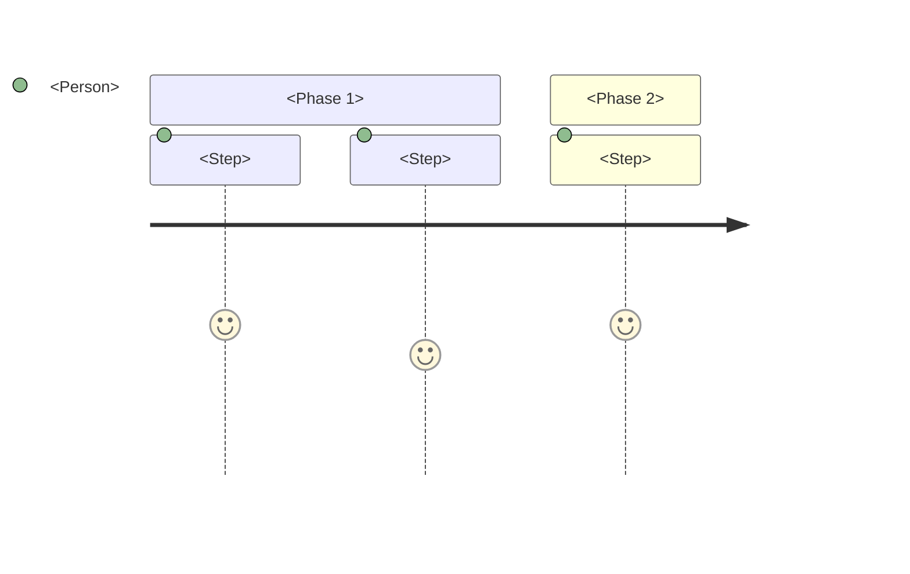

# Scenario template

Copy this file into `docs/product/scenarios/` and rename it to match
your scenario. Use the form `scn-<short-handle>.md` — for example,
`scn-cary-moderates-flag.md`.

Replace every `<placeholder>` with real content. Delete the
explanatory text in italics once you've filled in each section.

If you've never written a scenario before, read
`docs/process/how-we-spec-features.md` first.

---

# SCN-<NN>: <Person> <does what>

_Replace `<NN>` with a number — the next available in the sequence.
The title should be one line: a name + a verb, no jargon._

---

## Status

_One of: Draft, Accepted, Built, Verified, Retired._

**Draft**

## Build unit

_Which BU implements (or will implement) this scenario? If the
scenario isn't yet matched to a build unit, leave as `TBD`._

TBD

## Last updated

_Date you last edited this file._

April 2026

---

## 1. Title

_One sentence summary of the scenario. Same as the heading above
but as a complete sentence._

> <Eddie writes an urgent action call to his network and shares it
> via the GPS Action feed.>

---

## 2. Context

_Two or three sentences. Who is the person? What's their situation?
Why are they doing this today rather than yesterday or tomorrow? Be
specific — use a name, not "the user."_

> <Eddie Morales is a member who runs a 200-person WhatsApp group
> of local parents. He's just seen a council vote announcement that
> matters to his community. He has 24 hours before the council
> meeting and wants to coordinate a letter-writing campaign through
> his network.>

---

## 3. Steps

_Numbered list of physical actions, in order. One action per step.
Plain English — describe what the person does, not what the system
does. If a step combines multiple actions, split it._

1. <Eddie opens GPS Action on his phone>
2. <He's already logged in from earlier>
3. <He sees the feed, scrolls past two posts from this morning>
4. <He taps the "New post" button>
5. <The composer page loads with an empty form>
6. <He types a short title>
7. <He pastes the campaign URL into the Activist Mailer field>
8. <He confirms visibility is "public">
9. <He taps "Post">
10. <He's redirected to the feed; his post is at the top>

---

## 4. Expected outcome

_What's the world like after this scenario succeeds? Both for the
person AND for everyone else affected. Bullet points._

- <Eddie's post is at the top of the feed for everyone who loads
  it next>
- <Cary, Bette, and others see it on their next visit>
- <The post has an "Open in Activist Mailer" button that opens
  Eddie's campaign in a new browser tab>
- <The action is recorded in the audit log with Eddie as author>
- <Eddie can switch to a different user via "Switch user" and the
  post is still there>

---

## 5. What we're NOT doing

_Deliberately out of scope. Helps prevent scope creep and unstated
assumptions. Bullet points._

- <Eddie can't edit the post after publishing>
- <We don't notify Cary or anyone else proactively — they discover
  it on next visit>
- <We don't track who clicked "Open in Activist Mailer">
- <The post can't be scheduled to publish later>
- <Eddie's WhatsApp group isn't notified automatically>

---

## 6. How we'll know it worked

_Acceptance criteria a non-engineer can verify by clicking through
the product. Each bullet is a check. The list together describes a
full test plan._

- <I can log in as Eddie>
- <I see a "New post" button somewhere on /feed>
- <I can navigate from /feed to /compose with one click>
- <I can fill in title, body, and (optionally) AM URL>
- <I can pick visibility: public or authenticated only>
- <Submitting with valid input redirects me to /feed>
- <My new post appears at the top of /feed>
- <The AM button on my post opens the URL in a new tab>
- <If I leave the title empty, I see an error message>
- <If I paste a URL that isn't from activistmailer.com, I see an
  error message>

---

## 7. Open questions

_Optional. Things you weren't sure about while writing this. The
reviewer or the engineer will answer them._

- <Should the AM URL be checked once at submit, or also previewed
  before clicking Post?>
- <If Eddie loses signal mid-submit, what happens to the post?>
- <Should we show a confirmation message after posting?>

---

## 8. Related

_Optional. Links to other scenarios, ADRs, or specs that connect to
this one._

- See SCN-XX <if there's a related scenario>
- ADR D045 (visibility defaults)
- D048 (post types deferred)
- `docs/product/post-creation-flow.md`

---

## 9. Implementing code

_Filled in after the feature is built. Lists the files that
implement this scenario. Engineers update this — volunteers can
leave it blank._

- `app/compose/page.tsx`
- `app/compose/actions.ts`
- `components/PostForm.tsx`
- `components/ActivistMailerField.tsx`
- `server/services/post.ts` (createPost)
- `server/routers/post.ts` (.create)
- `shared/validation/post.ts`

---

## 10. Screenshot / journey diagram

_Optional but encouraged. A visual artefact showing the journey.
Replace with a real screenshot once the feature is live._

```
[ Screenshot placeholder — add after demo recording ]
```

_Or a Mermaid journey diagram:_



---

## Revision log

_Track edits over time. One line per edit._

- 2026-04 — initial draft
